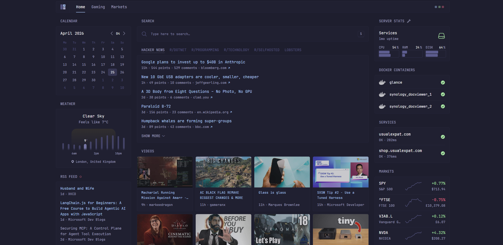
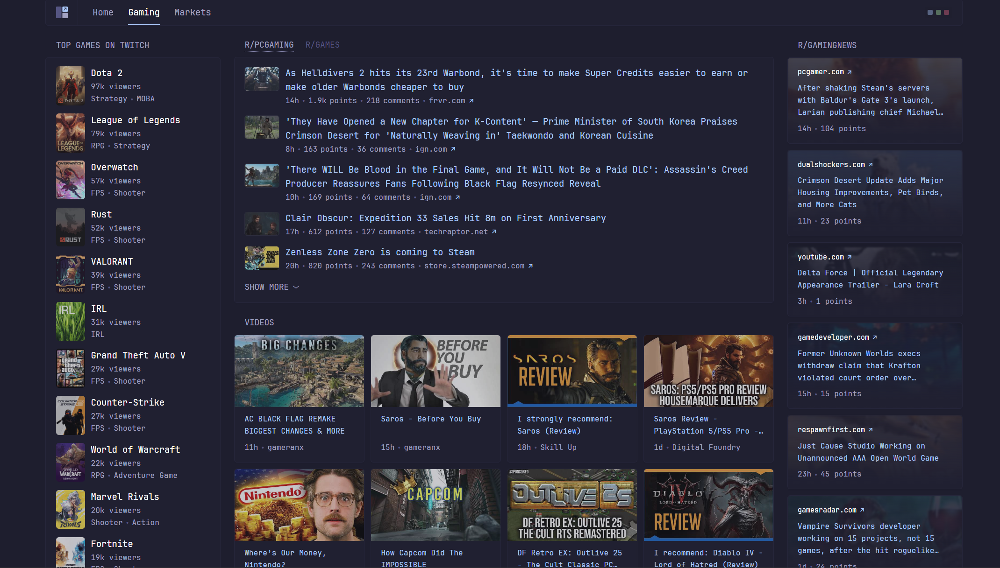
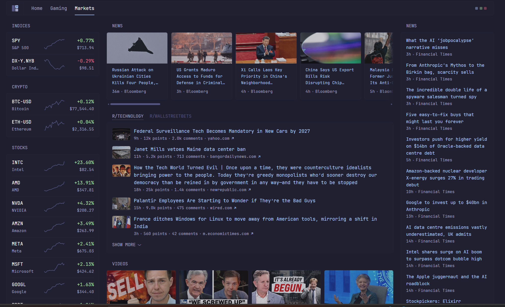

# glance-dashboard

My personal setup for Glance. Decided to wrap my slightly customised Glance dashboard in a Docker container to make it easier to manage and deploy.

## Build and push to Docker Hub

```bash
docker build -t glance-dashboard:local glance
docker login
docker tag glance-dashboard:local mgpeter/glance-dashboard:latest
docker push --all-tags mgpeter/glance-dashboard
```

## Screens

### Main



### Gaming



### Markets



## TODO

- [ ] Setup Github Actions to build and push to Docker Hub on new releases
- [ ] Review glance community widgets
- [ ] Setup Github PAT and list personal repo links/stats
- [ ] Azure app services stats